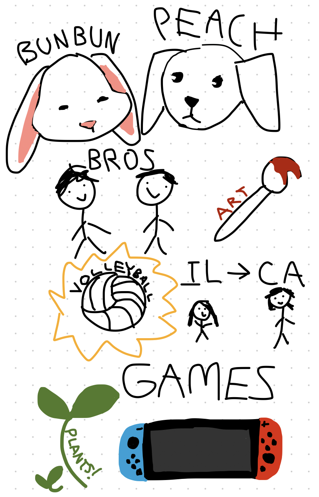

## Chloe's Page
Welcome to my blog! This page is dedicated to letting you know a bit more about me.

## About Me!
This trimester, I'm largely focusing on my classwork and involvement in the varsity volleyball team. Below I've included an outline of my class schedule, and some things about my life after school.

| Period | Class |
| :---: | :--- |
| 1 | AP Calculus AB |
| 2 | AP Biology |
| 3 | American Literature |
| 4 | AP Computer Science Principles |
| 5 | ENS 4 |

Bunbun and Peach are my two pets! Bunbun's a 7 year old rabbit, and Peach is a 4 month old puppy we got over the summer. 

Below them are pretty impressive stick figures of my brothers, as well as a paintbrush to show how much I love making art! 

I've been playing volleyball since I was 8 years old, and currently play for Del Norte. 

I was born in Illinois, specifically Chicago, and lived there until I moved here to San Diego when I began first grade. 

As shown in the bottom drawings, I like to play games in my free time and raise houseplants!

